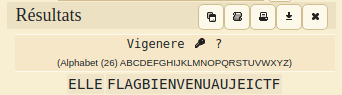

# JEI-CTF – Pas bête

* **Category:** Crypto
* **Points:** 250

## Challenge
>   L'apparence n'est pas toujours trompeuse. Elle peut être la clé de certains mystère.<br> JWLKFTPRZPYYEFUIMNEJ
## Solution
Alors ici il faut un peu se baser sur le texte à déchiffrer
l'ensemble de caractères du cypher texte se trouve uniquement dans l'alphabet français. Avec un brute force via cesar on
a rien de concret, il faut donc penser à autres choses, vigenere par exemple
avec un brute force de vigenere en spécifiant que JEICTF se trouve dans le texte
en clair on a:



NB:ELLE est la clef de chiffrement

le flag est donc:
```
JeiCtf_{ FLAGBIENVENUAUJEICTF }
```
