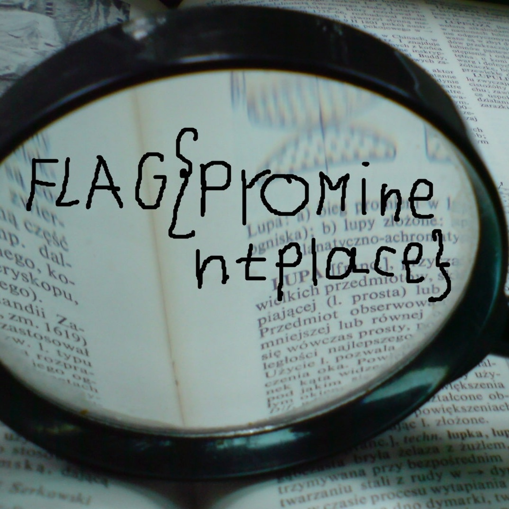

# JEI-CTF – Ruuuusssseeee

* **Catégorie :** Misc
* **Points :** 250

## Challenge

>Elliot demande a collegue de l'aider à cacher un information secrete.<br>
>**Hint!** переименуйте скрытую реперторию и файл, чтобы получить флаг


## Solution
Premièrement, on a essayé de traduire le hint. Il disait "_renommer le répertoire et le fichier cachés pour obtenir le drapeau_"

Sur ce, nous décompressons le fichier en question.

```console
Sancelisso@kali:~/JEI-CTF/Finals/Misc/Ressources$ unzip Rename.zip
Archive:  Rename.zip
   creating: some/
  inflating: some/[Content_Types].xml
   creating: some/_rels/
  inflating: some/_rels/.rels
   creating: some/.word/
  inflating: some/.word/document.xml
  inflating: some/.word/settings.xml
  inflating: some/.word/styles.xml
  inflating: some/.word/webSettings.xml
  inflating: some/.word/fontTable.xml
   creating: some/.word/_rels/
  inflating: some/.word/_rels/document.xml.rels
   creating: some/.word/.media/
  inflating: some/.word/.media/image1.jpg
  inflating: some/.word/.media/.image3.jpg
   creating: some/.word/theme/
  inflating: some/.word/theme/theme1.xml
   creating: some/docProps/
  inflating: some/docProps/core.xml
  inflating: some/docProps/app.xml
Sancelisso@kali:~/JEI-CTF/Finals/Misc/Ressources$

```
Après décompression du fichier,nous remarquons la présence d'un sous-dossier caché nommé _word_ au sein du quel se trouve l'image ci-après:



On pourra lire aisement le flag sur l'image  :joy:
<p align="center">

</p>

```
Jei_CTF{ ProMinenteplace }
```
