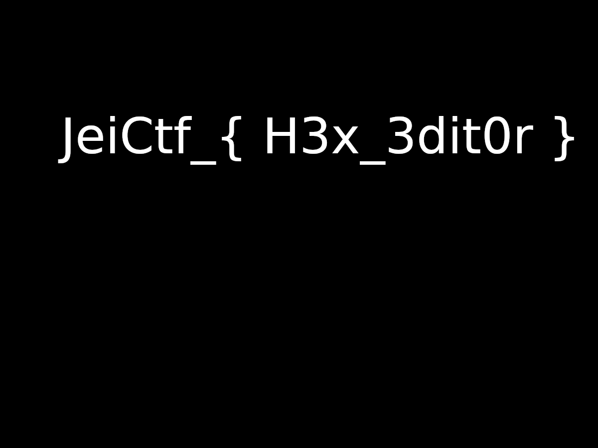

# JEI-CTF – Somebody

* **Catégorie :** Misc
* **Points :** 250

## Challenge

>  Et si il avait oublié qui il était <br>
>[Somebody.png](Ressources/Somebody.png)
## Solution
L'image mise à notre disposition était corrompue. Pour la corriger, nous avons utilisé l'outil [PCRT](https://github.com/sherlly/PCRT) conçu avec python.

```console
Sancelisso@kali:~/PCRT$ python PCRT.py -v -i /home/Sancelisso/Téléchargements/somebody.png

	 ____   ____ ____ _____
	|  _ \ / ___|  _ \_   _|
	| |_) | |   | |_) || |
	|  __/| |___|  _ < | |
	|_|    \____|_| \_\|_|

	PNG Check & Repair Tool

Project address: https://github.com/sherlly/PCRT
Author: sherlly
Version: 1.1

[Detected] Wrong PNG header!
File header: AAAAAAAAAAAAAAAA
Correct header: 89504E470D0A1A0A
[Notice] Auto fixing? (y or n) [default:y] y
[Finished] Now header:89504E470D0A1A0A
[Finished] Correct IHDR CRC (offset: 0x1D): B16DC8FA
[Finished] IHDR chunk check complete (offset: 0x8)
[Finished] Correct IDAT chunk data length (offset: 0x20E length: 2000)
[Finished] Correct IDAT CRC (offset: 0x2216): 12255849
[Finished] Correct IDAT chunk data length (offset: 0x221A length: 2000)
[Finished] Correct IDAT CRC (offset: 0x4222): 257A4AA5
[Finished] Correct IDAT chunk data length (offset: 0x4226 length: 186A)
[Finished] Correct IDAT CRC (offset: 0x5A98): 74E76301
[Finished] IDAT chunk check complete (offset: 0x20E)
[Finished] Correct IEND chunk
[Finished] IEND chunk check complete
[Finished] PNG check complete
[Notice] Show the repaired image? (y or n) [default:n] y
Sancelisso@kali:~/PCRT$
```
Suite à cela, une image est créée et contenant notre flag.

```
jeiCtf{ H3x_3ditor }
```
