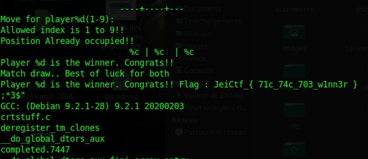

# JEI-CTF – tic tac toe

* **Category:** Misc
* **Points:** 350

## Challenge
>  Good game  <br>
> [tic](Ressources/tic)

## Solution
Il suffisait juste de taper la commande _strings_ sur le fichier en quoi et nous obtenons le flag comme la capture ci-après :grinning:



```
JeiCtf_{ 71c_74c_703_w1nn3r }
```
