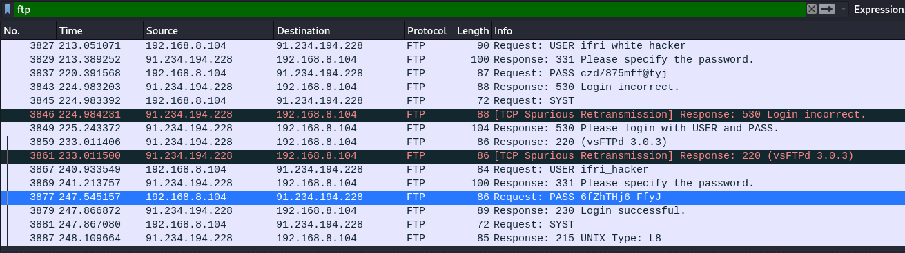

# JEI-CTF – Connect

* **Points:** 50

## Challenge

> Why don't you connect ?

## Solution

Sur le site du challenge, un fichier pcap est mis à notre disposition. Une fois le fichier ouvert, nous avons pensé à filtrer les paquets suivant les protocoles non sécurisés. A cet effet, en analysant les paquets ftp, nous obtenons des credentials de connexion à un serveur ftp.



* **Username:** ifri_hacker
* **Password:** 6fZhTHj6_FfyJ
* **Host:** 91.234.194.228
* **Port:** 21


Avec ces informations, nous allons nous connecter depuis un terminal.

```console
Sancelisso@kali:~/Bureau/JEI-CTF$ ftp 91.234.194.228
Connected to 91.234.194.228.
220 (vsFTPd 3.0.3)
Name (91.234.194.228:Sancelisso): ifri_hacker
331 Please specify the password.
Password:
230 Login successful.
Remote system type is UNIX.
Using binary mode to transfer files.
ftp> ls
200 PORT command successful. Consider using PASV.
150 Here comes the directory listing.
-rw-r--r--    1 0        0              29 Feb 16 08:38 Flag.txt
-rw-r--r--    1 0        0          520528 Feb 16 09:01 angel.png
226 Directory send OK.
ftp> get Flag.txt
local: Flag.txt remote: Flag.txt
200 PORT command successful. Consider using PASV.
150 Opening BINARY mode data connection for Flag.txt (29 bytes).
226 Transfer complete.
29 bytes received in 0.00 secs (99.7194 kB/s)
ftp> get angel.png
local: angel.png remote: angel.png
200 PORT command successful. Consider using PASV.
150 Opening BINARY mode data connection for angel.png (520528 bytes).
226 Transfer complete.
520528 bytes received in 12.64 secs (40.2112 kB/s)
ftp> quit
221 Goodbye.
```
Après connexion au serveur ftp, nous avons pu récupérer trois fichiers:
* [Flag.txt](Files/Flag.txt)
* [angel.png](Files/angel.png)


En ouvrant le premier fichier, on obtient le flag du challenge **Connect**
```
JeiCtf_{ L'37S_937_S7@R73D }
```
